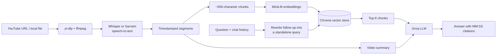

# AI Video Assistant

Turn any video or lecture into something you can **chat with, quiz yourself on, and actually remember**.

Paste a YouTube link or upload a video/audio file. The app transcribes it, summarizes it, and builds a searchable knowledge base, so you can ask questions and get answers with **timestamp citations** like `[12:34]`. From the same content it generates quizzes, study notes and spaced-repetition flashcards, and it tracks your progress over time.

Built as a semester project around a Retrieval-Augmented Generation (RAG) pipeline.

<!-- Add screenshots here before submission, e.g.:


-->

## Features

**Understand a video**
- Input from a **YouTube URL** or a **local video/audio file**
- Speech-to-text with **Whisper** (English) or **Sarvam AI** (Hinglish)
- Automatic **summary**, **action items**, **key decisions**, **open questions** and **category**
- **Frame extraction**: type `show me 2:30` to see the frame at that moment

**Chat with it (RAG)**
- Answers grounded in the transcript, with `[MM:SS]` timestamp citations
- **History-aware follow-ups**: "what did he say after that?" is rewritten into a standalone search query before retrieval
- Says *"I could not find this information in the video"* instead of guessing

**Study from it**
- **Quizzes** (multiple choice) that sample the **whole video**, not just the intro
- **Saved quiz attempts** with average / best / latest score and a **score-trend chart**
- **Flashcards with spaced repetition** (1 / 3 / 7 / 14-day schedule); generate them from a video or from the quiz questions you missed
- **Study notes** exported as a PDF

**Around it**
- Sign up / log in (bcrypt password hashing, signed session cookies)
- Chat history and "Recent" sessions you can reopen
- **Stats dashboard**: categories, languages, activity by day
- Admin view (for emails listed in `ADMIN_EMAILS`)

## How it works



For Hinglish videos the transcript has no per-segment timestamps, so retrieval falls back to plain text chunking (answers work, but without timestamp citations).

## Tech stack

| Area | Tools |
|---|---|
| UI | Streamlit, Plotly, pandas |
| LLM | Groq (default model `openai/gpt-oss-120b`) via LangChain |
| Speech-to-text | OpenAI Whisper (local), Sarvam AI (Hinglish) |
| Embeddings / vector store | `all-MiniLM-L6-v2` (sentence-transformers), Chroma |
| Media | yt-dlp, ffmpeg, pydub |
| Database | SQLite via SQLAlchemy |
| Auth | bcrypt, itsdangerous |
| PDF | fpdf2 |
| Tests | pytest |

## Getting started

### Prerequisites

- Python (developed and tested on 3.14)
- **ffmpeg** on your PATH
  - Ubuntu / WSL: `sudo apt-get install -y ffmpeg`
  - macOS: `brew install ffmpeg`
  - Windows: `winget install Gyan.FFmpeg`
- A free **Groq API key** from <https://console.groq.com>
- (Optional) a **Sarvam API key** from <https://www.sarvam.ai>, only needed for Hinglish videos

### Install

```bash
git clone https://github.com/<your-username>/ai-video-assistant.git
cd ai-video-assistant

python -m venv .venv
source .venv/bin/activate        # Windows: .venv\Scripts\activate

pip install -r requirements.txt
```

### Configure

```bash
cp .env.example .env
```

Open `.env` and fill in at least:

```
GROQ_API_KEY=your_key_here
SECRET_KEY=generate_one_below
```

Generate a secret key with:

```bash
python -c "import secrets; print(secrets.token_hex(32))"
```

**Never commit your `.env` file.** It is already in `.gitignore`.

### Check your setup, then run

```bash
python check_env.py       # verifies packages and ffmpeg
streamlit run app.py
```

Open <http://localhost:8501>, create an account, and paste a video link.

> The first run downloads the Whisper and embedding models, so it takes longer.

## Configuration

Everything is set in `.env` (see `.env.example` for the full list).

| Variable | Default | Purpose |
|---|---|---|
| `GROQ_API_KEY` | none (required) | LLM access |
| `SARVAM_API_KEY` | none | Hinglish transcription |
| `WHISPER_MODEL` | `small` | `tiny` / `base` / `small` / `medium` / `large` (bigger = slower, more accurate) |
| `GROQ_MODEL` | `openai/gpt-oss-120b` | Chat / generation model |
| `EMBEDDING_MODEL` | `all-MiniLM-L6-v2` | Retrieval embeddings |
| `RETRIEVER_K` | `6` | Chunks retrieved per question |
| `SECRET_KEY` | none | Signs session cookies |
| `ADMIN_EMAILS` | empty | Comma-separated emails that get the Admin view |

## Project structure

```
app.py                 Streamlit entry point
main.py                Analysis pipeline: transcribe, summarize, extract
check_env.py           Verifies packages and ffmpeg
config/                Settings, paths, logging
auth/                  Sign up / login
db/                    SQLAlchemy models and session
core/
  transcriber.py       Whisper / Sarvam speech-to-text
  vector_store.py      Chunking, embeddings, Chroma
  rag_engine.py        History-aware RAG chain
  chat_history.py      Cleans chat history before it reaches the LLM
  summarizer.py        Map-reduce summarization
  extractor.py         Action items, decisions, questions, category
  quiz_generator.py    Quiz generation (whole-video sampling)
  quiz_scoring.py      Scoring, summaries, trend data
  notes_generator.py   Study notes + PDF export
  flashcard_*.py       Flashcard generation and helpers
  spaced_repetition.py 1/3/7/14-day scheduler
  review_session.py    Flashcard review queue logic
  frame_extractor.py   Frame grabbing at a timestamp
ui/                    Streamlit pages and components
utils/                 Audio processing, chat sessions, history, quiz attempts, flashcards
scripts/               One-off scripts (JSON to SQLite migration)
tests/                 pytest suite
```

## Tests

```bash
python -m pytest
```

The suite (138 tests) covers configuration, history-aware retrieval helpers, quiz scoring and saved attempts, the spaced-repetition scheduler, flashcard generation and the database layer. LLM calls are mocked, and database tests run against a throwaway in-memory SQLite database, so your real data is never touched and no API key is needed to run them.

## Design decisions

- **History-aware retrieval.** A follow-up like "and after that?" makes a poor search query. Before retrieval, the question is rewritten into a standalone one using the recent conversation. If the rewrite fails, the app falls back to the original question instead of crashing.
- **Timestamp-aware chunks.** Chunks are built from Whisper's timestamped segments, so every retrieved passage knows where it came from and the model can cite `[MM:SS]`.
- **Whole-video coverage.** Quizzes, notes and flashcards sample evenly spaced chunks across the entire transcript instead of only reading the first few thousand characters. Quiz questions are interleaved and de-duplicated across chunks; notes stay in video order.
- **Plain-Python spaced repetition.** The 1 / 3 / 7 / 14-day schedule is ordinary date arithmetic in `core/spaced_repetition.py`. The LLM never does date math, which keeps scheduling predictable and testable. A correct answer moves a card up one stage, and a miss resets it to tomorrow.
- **Persistence never breaks the UI.** Saving a quiz attempt or flashcard logs a failure and carries on rather than crashing the page the user is on.
- **ORM from the start.** SQLAlchemy over SQLite, so moving to Postgres later is a configuration change, not a rewrite.

## Known limitations

- Hinglish videos have no timestamp citations (the speech-to-text service returns no segments).
- Quizzes, notes and flashcards make at most 4 LLM calls, so very long videos are sampled rather than read exhaustively.
- Vector stores are temporary and cleaned up after a configurable age (`VECTOR_STORE_MAX_AGE_HOURS`, default 2). Reopening an old chat rebuilds its knowledge base.
- Reopening an old chat shows its quiz fresh; earlier answers are kept in your stats but not restored into the quiz card.
- Retrieval quality has been checked by hand but there is no formal RAG evaluation set yet.
- Requires an internet connection and a Groq API key.

## Author

Built by Ayesha as a semester project.
